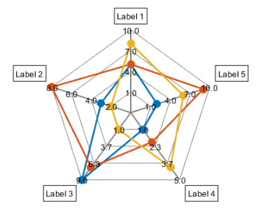
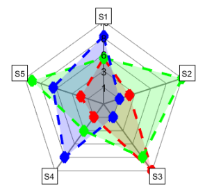
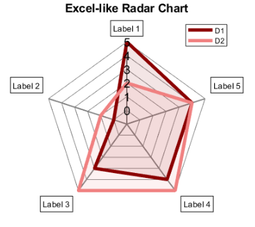
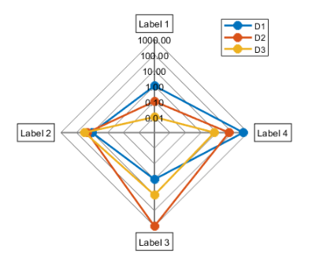

[](https://www.mathworks.com/matlabcentral/fileexchange/59561-spider_plot)

# spider_plot
Create a spider or radar plot with individual axes.

## Syntax:
**spider_plot(P)**
  

**spider_plot( ___, Name, Value)**

## Input Arguments:
*(Required)*

- **P** - The data points used to plot the spider chart. The rows are the groups of data and the columns are the data points.
          The axes labels and axes limits are automatically generated if not specified.
          [vector | matrix]

## Name-Value Pair Arguments:
*(Optional)*
  
- **AxesLabels**       - Used to specify the label each of the axes.
                         [auto-generated (default) | cell of strings | 'none']

- **AxesInterval**     - Used to change the number of intervals displayed between the webs.
                         [3 (default) | integer]

- **AxesPrecision**    - Used to change the precision level on the value displayed on the axes.
                         [1 (default) | integer]
                         
- **AxesDisplay**      - Used to change the number of axes in which the axes text are displayed. 'None' or 'one' can be used to simplify                          the plot appearance for normalized data.
                         ['all' (default) | 'none' | 'one']

- **AxesLimits**       - Used to manually set the axes limits. A matrix of 2 x size(P, 2). The top row is the minimum axes limits and                            the bottow row is the maximum axes limits.
                         [auto-scaled (default) | matrix]

- **FillOption**       - Used to toggle color fill option.
                         ['off' (default) | 'on']

- **FillTransparency** - Used to set color fill transparency.
                         [0.1 (default) | scalar in range (0, 1)]
                     
- **Color**            - Used to specify the line color, specified as an RGB triplet. The intensities must be in the range (0, 1).
                         [MATLAB colors (default) | RGB triplet]

- **LineStyle**        - Used to change the line style of the plots.
                         ['-' (default) | '--' | ':' | '-.' | 'none']

- **LineWidth**        - Used to change the line width, where 1 point is  1/72 of an inch.
                         [0.5 (default) | positive value]

- **Marker**           - Used to change the marker symbol of the plots.
                         ['o' (default) | '*' | 's' | 'd' | '+' | '.' | 'x' | '^' | 'v' | 'h' | 'none']

- **MarkerSize**       - Used to change the marker size, where 1 point is 1/72 of an inch.
                         [8 (default) | positive value]
                     
- **AxesFontSize**     - Used to change the font size of the values displayed on the axes.
                         [10 (default) | scalar value greater than zero]
                         
- **LabelFontSize**    - Used to change the font size of the labels.
                         [10 (default) | scalar value greater than zero]
                         
- **Direction**        - Used to change the direction of rotation of the plotted data and axis labels.
                         [counterclockwise (default) | clockwise]
                         
- **AxesLabelsOffset** - Used to adjust the position offset of the axes labels.
                         [0.1 (default) | positive value]
                         
- **AxesScaling**      - Used to change the scaling of the axes.
                         ['linear' (default) | 'log']
                         
## Examples:
### Example 1: Minimal number of arguments. All optional arguments are set to their default values. Axes labels and limits are automatically set.
```matlab
% Initialize data points
D1 = [5 3 9 1 2];   
D2 = [5 8 7 2 9];
D3 = [8 2 1 4 6];
P = [D1; D2; D3];

% Spider plot
spider_plot(P);

% Legend settings
legend('D1', 'D2', 'D3', 'Location', 'southoutside');
```


### Example 2: Manually setting the axes limits. All other optional arguments are set to their default values.
```matlab
% Initialize data points
D1 = [5 3 9 1 2];   
D2 = [5 8 7 2 9];
D3 = [8 2 1 4 6];
P = [D1; D2; D3];

% Spider plot
spider_plot(P,...
    'AxesLimits', [1, 2, 1, 1, 1; 10, 8, 9, 5, 10]); % [min axes limits; max axes limits]
```


### Example 3: Set fill option on. The fill transparency can be adjusted.
```matlab
% Initialize data points
D1 = [5 3 9 1 2];   
D2 = [5 8 7 2 9];
D3 = [8 2 1 4 6];
P = [D1; D2; D3];

% Spider plot
spider_plot(P,...
    'AxesLabels', {'S1', 'S2', 'S3', 'S4', 'S5'},...
    'AxesInterval', 2,...
    'FillOption', 'on',...
    'FillTransparency', 0.1);
```


  ### Example 4: Maximum number of arguments.
```matlab
% Initialize data points
D1 = [5 3 9 1 2];   
D2 = [5 8 7 2 9];
D3 = [8 2 1 4 6];
P = [D1; D2; D3];

% Spider plot
spider_plot(P,...
    'AxesLabels', {'S1', 'S2', 'S3', 'S4', 'S5'},...
    'AxesInterval', 4,...
    'AxesPrecision', 0,...
    'AxesDisplay', 'one',...
    'AxesLimits', [1, 2, 1, 1, 1; 10, 8, 9, 5, 10],...
    'FillOption', 'on',...
    'FillTransparency', 0.2,...
    'Color', [1, 0, 0; 0, 1, 0; 0, 0, 1],...
    'LineStyle', '--',...
    'LineWidth', 3,...
    'Marker', 'd',...
    'MarkerSize', 10,...
    'AxesFontSize', 12,...
    'LabelFontSize', 10,...
    'Direction', 'clockwise',...
    'AxesLabelsOffset', 0,...
    'AxesScaling', 'linear');
```


  ### Example 5: Excel-like radar charts.
```matlab
% Initialize data points
D1 = [5 0 3 4 4]; 
D2 = [2 1 5 5 4];
P = [D1; D2];

% Spider plot
spider_plot(P,...
    'AxesInterval', 5,...
    'AxesPrecision', 0,...
    'AxesDisplay', 'one',...
    'AxesLimits', [0, 0, 0, 0, 0; 5, 5, 5, 5, 5],...
    'FillOption', 'on',...
    'FillTransparency', 0.1,...
    'Color', [139, 0, 0; 240, 128, 128]/255,...
    'LineWidth', 4,...
    'Marker', 'none',...
    'AxesFontSize', 14,...
    'LabelFontSize', 10);

% Title and legend settings
title(sprintf('Excel-like Radar Chart'),...
    'FontSize', 14);
legend_str = {'D1', 'D2'};
legend(legend_str, 'Location', 'southoutside');
```


  ### Example 6: Logarithimic scale on all axes. Axes limits and axes intervals are automatically set to factors of 10.
```matlab
% Initialize data points
D1 = [-1 10 1 500];   
D2 = [-10 20 1000 60];
D3 = [-100 30 10 7];
P = [D1; D2; D3];

% Spider plot
spider_plot(P,...
    'AxesPrecision', 2,...
    'AxesDisplay', 'one',...
    'AxesScaling', 'log');
    
% Legend settings
legend('D1', 'D2', 'D3', 'Location', 'northeast');
```


  ### Example 7: Spider plot with tiledlayout feature in R2019b.
```matlab
% Initialize data points
D1 = [5 3 9 1 2];
D2 = [5 8 7 2 9];
D3 = [8 2 1 4 6];
P = [D1; D2; D3];

% Titled layout
t = tiledlayout(2, 2);

% Tile 1
nexttile;
spider_plot_R2019b(P,...
    'AxesInterval', 1,...
    'AxesPrecision', 0);

% Tile 2
nexttile;
spider_plot_R2019b(P,...
    'AxesInterval', 1,...
    'AxesPrecision', 0);

% Tile 3
nexttile(3, [1, 2]);
spider_plot_R2019b(P,...
    'AxesInterval', 1,...
    'AxesPrecision', 0);

% Tile properties
t.TileSpacing = 'compact';
t.Padding = 'compact';
title(t, 'Spider Plots');
```


## Author:
Moses Yoo, (jyoo at hatci dot com)
- 2020-01-27: Corrected bug where only 7 entries were allowed in legend.
- 2020-01-06: Added support for subplot and tiledlayout feature (tiledlayout introduced in R2019b).

- 2019-11-27: Add option to change axes to logarithmic scale.

- 2019-11-15: Add feature to customize the plot rotational direction and the offset position of the axis labels.

- 2019-10-28: Major revision in implementing the new function argument validation feature introduced in R2019b. Replaced previous method of error checking and setting of default values.

- 2019-10-23: Minor revision to set starting axes as the vertical line. Add customization option for font sizes and axes display.
  
- 2019-10-16: Minor revision to add name-value pairs for customizing color, marker, and line settings.
  
- 2019-10-08: Another major revision to convert to name-value pairs and add color fill option.
  
- 2019-09-17: Major revision to improve speed, clarity, and functionality

## Special Thanks:
Special thanks to Gabriela Andrade, Andrés Garcia, Jiro Doke, Alex Grenyer, Tobias Kern, Omar Hadri & Zafar Ali for their feature recommendations and suggested bug fixes.

[](https://www.mathworks.com/matlabcentral/fileexchange/59561-spider_plot)
