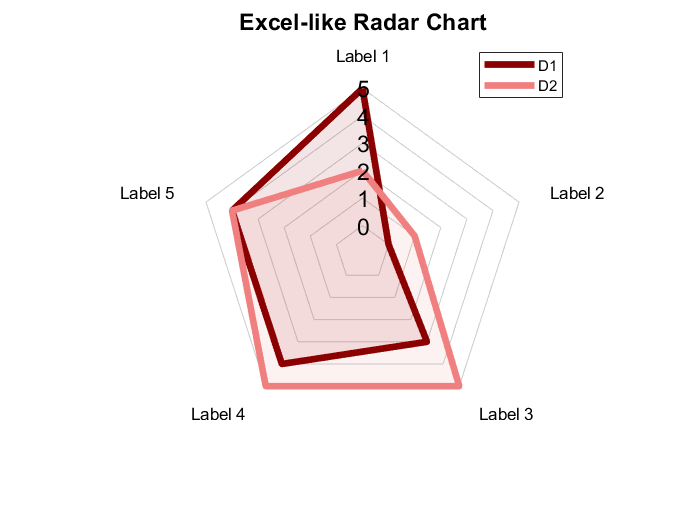

[](https://www.mathworks.com/matlabcentral/fileexchange/59561-spider_plot)

# spider_plot
Create a spider or radar plot with customizable individual axes.

The three functions included have the same functionality but with 3 different implementation:
- **spider_plot()** is compatible with most MATLAB versions.
- **spider_plot_R2019b()** is compatible with R2019b and above. It uses the new argument validation feature.
- **spider_plot_class()** is compatible with R2019b and above. It uses the new chart class feature.

## Syntax:
**spider_plot(P)**

**spider_plot(P, Name, Value, ...)**

**h = spider_plot(_)**

## Input Arguments:
*(Required)*

- **P** - The data points used to plot the spider chart. The rows are the groups of data and the columns are the data points.
          The axes labels and axes limits are automatically generated if not specified.
          [vector | matrix]

## Output Arguments:
*(Optional)*
- **h**                - Figure handle of spider plot.
                         [figure object]

## Name-Value Pair Arguments:
*(Optional)*
  
- **AxesLabels**       - Used to specify the label each of the axes.
                         [auto-generated (default) | cell of strings | 'none']

- **AxesInterval**     - Used to change the number of intervals displayed between the webs.
                         [3 (default) | integer]

- **AxesPrecision**    - Used to change the precision level on the value displayed on the axes.
                         [1 (default) | integer | vector]
                         
- **AxesDisplay**      - Used to change the number of axes in which the axes text are displayed. 'None' or 'one' can be used to simplify the plot appearance for normalized data.
                         ['all' (default) | 'none' | 'one' | 'data']

- **AxesLimits**       - Used to manually set the axes limits. A matrix of 2 x size(P, 2). The top row is the minimum axes limits and the bottow row is the maximum axes limits.
                         [auto-scaled (default) | matrix]

- **FillOption**       - Used to toggle fill color option.
                         ['off' (default) | 'on' | cell array of character vectors]

- **FillTransparency** - Used to set fill color transparency.
                         [0.1 (default) | scalar in range (0, 1) | vector]
                     
- **Color**            - Used to specify the line color, specified as an RGB triplet. The intensities must be in the range (0, 1).
                         [MATLAB colors (default) | RGB triplet]

- **LineStyle**        - Used to change the line style of the plots.
                         ['-' (default) | '--' | ':' | '-.' | 'none' | cell array of character vectors]

- **LineWidth**        - Used to change the line width, where 1 point is  1/72 of an inch.
                         [0.5 (default) | positive value | vector]
                         
- **LineTransparency** - Used to set the line color transparency.
                         [1 (default) | scalar in range (0, 1) | vector]

- **Marker**           - Used to change the marker symbol of the plots.
                         ['o' (default) | '*' | 's' | 'd' | '+' | '.' | 'x' | '^' | 'v' | 'h' | 'none' | cell array of character vectors]

- **MarkerSize**       - Used to change the marker size, where 1 point is 1/72 of an inch.
                         [36 (default) | positive value | vector]
                         
- **MarkerTransparency** - Used to set the marker color transparency.
                         [1 (default) | scalar in range (0, 1) | vector]
                         
- **AxesFont**         - Used to change the font type of the values displayed on the axes.
                         [Helvetica (default) | supported font name]
                         
- **LabelFont**        - Used to change the font type of the labels.
                         [Helvetica (default) | supported font name]                     
                     
- **AxesFontSize**     - Used to change the font size of the values displayed on the axes.
                         [10 (default) | scalar value greater than zero]
                         
- **AxesFontColor**    - Used to change the font color of the values displayed on the axes.
                         [black (default) | RGB triplet]
                         
- **LabelFontSize**    - Used to change the font size of the labels.
                         [10 (default) | scalar value greater than zero]
                         
- **Direction**        - Used to change the direction of rotation of the plotted data and axis labels.
                         ['clockwise' (default) | 'counterclockwise']
                         
- **AxesDirection**    - Used to change the direction of axes.
                         ['normal' (default) | 'reverse' | cell array of character vectors]
                         
- **AxesLabelsOffset** - Used to adjust the position offset of the axes labels.
                         [0.2 (default) | positive value]

- **AxesDataOffset**   - Used to adjust the position offset of the data labels when AxesDisplay is set to 'data'.
                         [0.1 (default) | positive value]
                         
- **AxesScaling**      - Used to change the scaling of the axes.
                         ['linear' (default) | 'log' | cell array of character vectors]
                         
- **AxesColor**        - Used to change the color of the spider axes.
                         [grey (default) | RGB triplet | hexadecimal color code]
                         
- **AxesLabelsEdge**   - Used to change the edge color of the axes labels.
                         [black (default) | RGB triplet | hexadecimal color code | 'none']

- **AxesOffset**       - Used to change to axes offset from the origin.
                         [1 (default) | any integer less than the axes interval]

- **AxesZoom**         - Used to change zoom of axes.
                         [0.7 (default) | scalar in range (0, 1)]

- **AxesHorzAlign**    - Used to change the horizontal alignment of axes tick labels.
                         ['center' (default) | 'left' | 'right' | 'quadrant']

- **AxesVertAlign**    - Used to change the vertical aligment of axes tick labels.
                         ['middle' (default) | 'top' | 'cap' | 'bottom' | 'baseline' | 'quadrant']

- **PlotVisible**      - Used to change the visibility of the plotted lines and markers.
                         ['on' (default) | 'off']

- **AxesTickLabels**   - Used to change the axes tick labels.
                         ['data' (default) | cell array of character vectors]

- **AxesInterpreter**  - Used to change the text interpreter of axes labels and axes tick labels.
                         ['tex' (default) | 'latex' | 'none' | cell array of character vectors]

- **BackgroundColor**  - Used to change the color of the background.
                         ['white' (default) | RGB triplet | hexadecimal color code | 'r' | 'g' | 'b' | ...]

- **MinorGrid**        - Used to toggle the minor grid.
                         ['off' (default) | 'on']

- **MinorGridInterval**- Used to change number of minor grid lines in between the major grid lines.
                         [2 (default) | integer value greater than zero]

- **AxesZero**         - Used to add a reference axes at value zero.
                         ['off' (default) | 'on']

- **AxesZeroColor**    - Used to change the color of the zero reference axes.
                         ['black' (default) | RGB triplet | hexadecimal color code | 'r' | 'g' | 'b' | ...]

- **AxesZeroWidth**    - Used to change the line width of the zero reference axes.
                         [2 (default) | positive value]

- **AxesRadial**       - Used to toggle radial axes.
                         ['on' (default) | 'off']

- **AxesAngular**      - Used to toggle angular axes.
                         ['on' (default) | 'off']


*(spider_plot_class only properties)*
- **LegendLabels**      - Used to add the labels to the legend.
                          [cell array of character vectors]
                         
- **LegendHandle**      - Used to customize legend settings.
                          [legend handle object]
                         
- **TiledLayoutHandle** - Used to customize tiled layout settings.
                          [tiled chart layout handle object]

- **TiledLegendHandle** - Used to customize tiled legend settings.
                          [legend handle object of tiled layout]

- **NextTileIter**      - Iterates with consecutive tile plots.
                          [1 (default)]
                         
## Examples:
### Example 1: Minimal number of arguments. All optional arguments are set to their default values. Axes labels and limits are automatically set.
```matlab
% Initialize data points
D1 = [5 3 9 1 2];   
D2 = [5 8 7 2 9];
D3 = [8 2 1 4 6];
P = [D1; D2; D3];

% Spider plot
spider_plot(P);

% Legend settings
legend('D1', 'D2', 'D3', 'Location', 'southoutside');
```
<p align="center">
  
</p>


### Example 2: Manually setting the axes limits and axes precision. All other optional arguments are set to their default values.
```matlab
% Initialize data points
D1 = [5 3 9 1 2];   
D2 = [5 8 7 2 9];
D3 = [8 2 1 4 6];
P = [D1; D2; D3];

% Spider plot
spider_plot(P,...
    'AxesLimits', [1, 2, 1, 1, 1; 10, 8, 9, 5, 10],... % [min axes limits; max axes limits]
    'AxesPrecision', [0, 1, 1, 1, 1]);
```
<p align="center">
  
</p>


### Example 3: Set fill option on. The fill transparency can be adjusted.
```matlab
% Initialize data points
D1 = [5 3 9 1 2];   
D2 = [5 8 7 2 9];
D3 = [8 2 1 4 6];
P = [D1; D2; D3];

% Spider plot
spider_plot(P,...
    'AxesLabels', {'S1', 'S2', 'S3', 'S4', 'S5'},...
    'AxesInterval', 2,...
    'FillOption', {'on', 'on', 'off'},...
    'FillTransparency', [0.2, 0.1, 0.1]);
```
<p align="center">
  
</p>


  ### Example 4: Maximum number of arguments.
```matlab
% Initialize data points
D1 = [5 3 9 1 2];   
D2 = [5 8 7 2 9];
D3 = [8 2 1 4 6];
P = [D1; D2; D3];

% Spider plot
spider_plot(P,...
    'AxesLabels', {'S1', 'S2', 'S3', 'S4', 'S5'},...
    'AxesInterval', 4,...
    'AxesPrecision', 0,...
    'AxesDisplay', 'one',...
    'AxesLimits', [1, 2, 1, 1, 1; 10, 8, 9, 5, 10],...
    'FillOption', 'on',...
    'FillTransparency', 0.2,...
    'Color', [1, 0, 0; 0, 1, 0; 0, 0, 1],...
    'LineStyle', {'--', '-', '--'},...
    'LineWidth', [1, 2, 3],...
    'LineTransparency', 1,...
    'Marker', {'o', 'd', 's'},...
    'MarkerSize', [8, 10, 12],...
    'MarkerTransparency', 1,...
    'AxesFont', 'Times New Roman',...
    'LabelFont', 'Times New Roman',...
    'AxesFontSize', 12,...
    'LabelFontSize', 10,...
    'Direction', 'clockwise',...
    'AxesDirection', {'reverse', 'normal', 'normal', 'normal', 'normal'},...
    'AxesLabelsOffset', 0.2,...
    'AxesDataOffset', 0.1,...
    'AxesScaling', 'linear',...
    'AxesColor', [0.6, 0.6, 0.6],...
    'AxesLabelsEdge', 'none',...
    'AxesOffset', 1,...
    'AxesZoom', 1,...
    'AxesHorzAlign', 'quadrant',...
    'AxesVertAlign', 'quadrant',...
    'PlotVisible', 'on',...
    'AxesTickLabels', 'data',...
    'AxesInterpreter', 'tex',...
    'BackgroundColor' , 'w',...
    'MinorGrid', 'off',...
    'MinorGridInterval', 2,...
    'AxesZero', 'off',...
    'AxesZeroColor', 'k',...
    'AxesZeroWidth', 2,...
    'AxesRadial', 'on',...
    'AxesAngular', 'on');
```
<p align="center">
  
</p>


  ### Example 5: Excel-like radar charts.
```matlab
% Initialize data points
D1 = [5 0 3 4 4]; 
D2 = [2 1 5 5 4];
P = [D1; D2];

% Spider plot
spider_plot(P,...
    'AxesInterval', 5,...
    'AxesPrecision', 0,...
    'AxesDisplay', 'one',...
    'AxesLimits', [0, 0, 0, 0, 0; 5, 5, 5, 5, 5],...
    'FillOption', 'on',...
    'FillTransparency', 0.1,...
    'Color', [139, 0, 0; 240, 128, 128]/255,...
    'LineWidth', 4,...
    'Marker', 'none',...
    'AxesFontSize', 14,...
    'LabelFontSize', 10,...
    'AxesColor', [0.8, 0.8, 0.8],...
    'AxesLabelsEdge', 'none',...
    'AxesRadial', 'off');

% Title and legend settings
title(sprintf('Excel-like Radar Chart'),...
    'FontSize', 14);
legend_str = {'D1', 'D2'};
legend(legend_str, 'Location', 'southoutside');
```
<p align="center">
  
</p>


  ### Example 6: Logarithimic scale on specified axes. Axes limits and axes intervals can be individually set as well.
```matlab
% Initialize data points
D1 = [5 3 9 1 1];
D2 = [5 8 7 2 10];
D3 = [8 2 1 4 100];
P = [D1; D2; D3];

% Spider plot
spider_plot(P,...
    'AxesInterval', 2,...
    'AxesPrecision', 0,...
    'AxesFontSize', 10,...
    'AxesLabels', {'Linear Scale', 'Linear Scale', 'Linear Scale', 'Linear Scale', 'Logarithimic Scale'},...
    'AxesScaling', {'linear', 'linear', 'linear', 'linear', 'log'},...
    'AxesLimits', [1, 1, 1, 1, 1; 10, 10, 10, 10, 100]);
    
% Legend properties
legend('D1', 'D2', 'D3', 'Location', 'northeast');
```
<p align="center">
  
</p>


  ### Example 7a: Spider plot with tiledlayout feature in R2019b.
```matlab
% Initialize data points
D1 = [5 3 9 1 2];
D2 = [5 8 7 2 9];
D3 = [8 2 1 4 6];
P = [D1; D2; D3];

% Titled layout
t = tiledlayout(2, 2);

% Tile 1
nexttile;
spider_plot_R2019b(P,...
    'AxesInterval', 1,...
    'AxesPrecision', 0);

% Tile 2
nexttile;
spider_plot_R2019b(P,...
    'AxesInterval', 1,...
    'AxesPrecision', 0);

% Tile 3
nexttile(3, [1, 2]);
spider_plot_R2019b(P,...
    'AxesInterval', 1,...
    'AxesPrecision', 0);

% Tile properties
t.TileSpacing = 'compact';
t.Padding = 'compact';
title(t, 'Spider Plots');
```
<p align="center">
  
</p>

### Example 7b: Spider plot class with tiledlayout feature.
```matlab
% Initialize data points
D1 = [5 3 9 1 2];
D2 = [5 8 7 2 9];
D3 = [8 2 1 4 6];
P = [D1; D2; D3];
close all;
clc;

% Individual spider plots
figure;
s1 = spider_plot_class(P);
s1.LegendLabels = {'Data1a', 'Data1b', 'Data1c'};
s1.AxesZoom = 1;
s1.AxesHorzAlign = 'quadrant';
s1.AxesVertAlign = 'quadrant';

figure;
s2 = spider_plot_class(P);
s2.LegendLabels = {'Data2a', 'Data2b', 'Data2c'};
s2.AxesZoom = 1;
s2.AxesHorzAlign = 'center';
s2.AxesVertAlign = 'top';

figure;
s3 = spider_plot_class(P);
s3.LegendLabels = {'Data3a', 'Data3b', 'Data3c'};
s3.AxesZoom = 1;
s3.AxesHorzAlign = 'left';
s3.AxesVertAlign = 'middle';

% Tiled layout
s1.tiledlayout(2, 2);

% Next tiles
s1.nexttile(s1);
s1.nexttile(s2);
s1.nexttile(s3, 3, [1, 2]);

% Tiled layout settings
s1.TiledLayoutHandle.TileSpacing = 'none';
s1.TiledLayoutHandle.Padding = 'compact';
title(s1.TiledLayoutHandle, "Spider Plots");

% Legend settings
s1.tiledlegend('FontSize', 8);
s1.TiledLegendHandle.Layout.TileSpan = [1, 2];
s1.TiledLegendHandle.Layout.Tile = 1;
```
<p align="center">
  
</p>

### Example 8: Spider plot with values only on data points.
```matlab
% Initialize data points
D1 = [1 3 4 1 2];
D2 = [5 8 7 5 9];
P = [D1; D2];

% Spider plot
s = spider_plot_class(P);
s.AxesLimits = [1, 1, 1, 1, 1; 10, 10, 10, 10, 10];
s.AxesDisplay = 'data';
s.AxesLabelsOffset = 0.2;
s.AxesDataOffset = 0.1;
s.AxesFontColor = [0, 0, 1; 1, 0, 0];

% Legend properties
s.LegendLabels = {'D1', 'D2'};
s.LegendHandle.Location = 'northeastoutside';
```
<p align="center">
  
</p>

### Example 9: Spider plot with text as axes tick labels.
```matlab
% Initialize data points
D1 = [5 3 9 1 2];
D2 = [5 8 7 2 9];
D3 = [8 2 1 4 6];
P = [D1; D2; D3];

% Spider plot
spider_plot(P,...
    'AxesTickLabels', {'first', 'second', 'third', 'fourth'});
```
<p align="center">
  
</p>

### Example 10: Spider plot with interpreter setting customized for each axes label.
```matlab
% Initialize data points
D1 = [5 3 9 1 2];
D2 = [5 8 7 2 9];
D3 = [8 2 1 4 6];
P = [D1; D2; D3];

% Spider plot
spider_plot(P,...
    'AxesLabels', {'\beta=1', '$\int_1^{20} x^2 dx$', '$\mathcal{O}$', 'Normal', 'Normal'},...
    'AxesInterpreter', {'tex', 'latex', 'latex', 'none', 'none'});
```
<p align="center">
  
</p>

## Author:
Moses Yoo, (juyoung.m.yoo at gmail dot com)
- 2022-02-14: Add support for reference axes at value zero. Allow for toggling radial and angular axes on or off.

- 2022-01-23: Add ability to change figure/axes background color. Allow for toggling minor grid lines.

- 2022-01-03: Fix legend to include line and marker attributes.

- 2021-11-24: Fix axes labels misalignment. Add option to set offset for data display values.

- 2021-11-09: Add option to change the text interpreter of axes labels and axes tick labels.

- 2021-11-01: Allow for plot lines and markers to be hidden. Allow for custom text of axes tick labels.

- 2021-04-17: Fix data display values when log scale is set.

- 2021-04-13: Add option to adjust line and marker transparency.

- 2021-04-08: Add option for data values to be displayed on axes. Add support to adjust axes font colors.

- 2021-03-19: Allow legend to be global in tiledlayout in spider_plot_class. Allow axes values to be shifted. Allow axes zoom level to be adjusted.

- 2021-03-17: Implement tiledlayout and nexttile compatibility in spider_plot_class.

- 2020-12-09: Allow fill option and fill transparency for each data group.

- 2020-12-01: Added support for adjust the axes offset from origin.

- 2020-11-30: Allow for one data group without specified axes limits.

- 2020-11-30: Added support for changing axes and label font type.

- 2020-10-08: Adjust axes precision to be set to one or more axis.

- 2020-09-30: Updated examples and added ability to reverse axes direction.

- 2020-07-05: Added feature to change spider axes and axes labels edge color.

- 2020-06-17: Allow logarithmic scale to be set to one or more axis.

- 2020-03-26: Added feature to allow different line styles, line width, marker type, and marker sizes for the data groups.

- 2020-02-17: Major revision in converting the function into a custom chart class. New feature introduced in R2019b.

- 2020-02-12: Fixed condition and added error checking for when only one data group is plotted.

- 2020-01-27: Corrected bug where only 7 entries were allowed in legend.

- 2020-01-06: Added support for subplot and tiledlayout feature (tiledlayout introduced in R2019b).

- 2019-11-27: Add option to change axes to logarithmic scale.

- 2019-11-15: Add feature to customize the plot rotational direction and the offset position of the axis labels.

- 2019-10-28: Major revision in implementing the new function argument validation feature introduced in R2019b. Replaced previous method of error checking and setting of default values.

- 2019-10-23: Minor revision to set starting axes as the vertical line. Add customization option for font sizes and axes display.
  
- 2019-10-16: Minor revision to add name-value pairs for customizing color, marker, and line settings.
  
- 2019-10-08: Another major revision to convert to name-value pairs and add color fill option.
  
- 2019-09-17: Major revision to improve speed, clarity, and functionality

## Special Thanks:
Special thanks to the following people for their feature recommendations and bug finds.
- Gabriela Andrade
- Andrés Garcia
- Jiro Doke
- Alex Grenyer
- Tobias Kern
- Omar Hadri
- Zafar Ali
- Christophe Hurlin
- Sean de Wolski
- Roman
- Mariusz Sepczuk
- Mohamed Abubakr
- Maruis Mueller
- Nicolai
- Jingwei Too
- Cedric Jamet
- Richard Ruff
- Marie-Kristin Schreiber
- Jean-Baptise Billaud
- Juan Carlos Vargas Rubio
- Anthony Wang
- Hanting Zhu
- Pauline Oeuvray
- Oliver Nicholls
- Yu-Chi Chen
- Fabrizio De Caro
- Waqas Ahmad
- Mario Di Siena

[](https://www.mathworks.com/matlabcentral/fileexchange/59561-spider_plot)